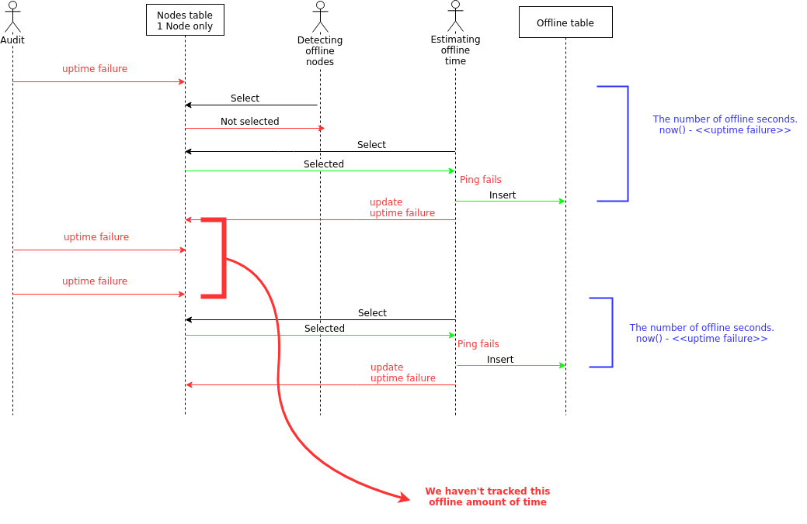

# Storage Node Downtime Tracking

## Abstract

This document describes storage node downtime tracking.

## Background

[Disqualification design document](disqualification.md) describes how storage nodes get disqualified based on the reputation scores described in [node selection design document](node-selection.md).

Current disqualification based on uptime disqualified several nodes without clear and fair evidence. These disqualifications needed to be reverted and the uptime based disqualification disabled. Before we can start handling disqualifications we need to more reliably track offline status of nodes.

[Kademlia removal design document](kademia-removal.md) describes that each node will need to contact each satellite regularly every hour. This is used in the following design.

This document does not describe how the downtime affects reputation and how disqualifications will work.

## Design

For tracking offline duration we need:

- A new SQL database table to store offline duration.
- Detecting which nodes are offline.
- Estimate how long they are offline.

An _uptime check_ referenced in this section is a connection initiated by the satellite to any storage node in the same way that's described in [network refreshing section of the Kademlia removal design document](kademia-removal.md#network-refreshing).

__NOTE__ the SQL code in this section is illustrative for explaining the algorithm concisely.

### Database

The following new SQL database table will store storage nodes offline time.

```sql
CREATE TABLE nodes_offline_time (
    node_id    BYTEA NOT NULL,
    tracked_at timestamp with time zone NOT NULL,
    seconds    integer, -- Measured number of seconds being offline
    CONSTRAINT nodes_offline_time__pk PRIMARY KEY(node_id, tracked_at)
)
```

The current Satellite database has the table `nodes`. For the offline time calculation we use the following columns:

- `last_contact_success`
- `last_contact_failure`
- `total_uptime_count`
- `uptime_success_count`

### Detecting offline nodes

Per [Kademlia removal design document](https://github.com/storj/storj/blob/master/docs/design/kademlia-removal.md#network-refreshing), any storage node has to ping the satellite every hour. For storage nodes that have not pinged, we need to contact them directly.

For finding the potentially offline storage nodes, we run a chore, with the following query:

```sql
SELECT
FROM nodes
WHERE
    last_contact_success < (now()  - 1h) AND
    last_contact_success > last_contact_failure AND
    disqualified IS NULL
ORDER BY
    last_contact_success ASC
```

For each node, the satellite performs an _uptime check_.

* On success, it updates the nodes table with the last contact information:

    ```sql
        UPDATE nodes
        SET
            last_contact_success = MAX(now(), last_contact_success),
            uptime_success_count = uptime_success_count + 1,
            total_uptime_count = total_uptime_count + 1
        WHERE
            id = ?
    ```

* On failure, it calculates the number of offline seconds.

  We know that storage nodes must contact the satellite every hour, hence we can estimate that it must have been at least for `now - last_contact_success - 1h` offline.

  ```
  num_seconds_offline = seconds(from: last_contact_success, to: now() - 1h)
  ```

  ```sql
  INSERT INTO nodes_offline_time (node_id, tracked_time, seconds)
  VALUES (<<id>>, now(), <<num_seconds_offline>>)
  ```

  ```sql
  UPDATE nodes
  SET
    last_contact_failure = now(),
    total_uptime_count = total_uptime_count +1
  WHERE
    id = ?
   ```

### Estimating offline time

Another independent chore has the following configurable parameters:

- Interval,
- Number of nodes to check.

The process loops all failed nodes with query:

```sql
SELECT
FROM nodes
WHERE
    last_contact_success < last_contact_failure AND
    disqualified IS NULL
ORDER BY
    last_contact_failure ASC
LIMIT N
```

It checks the configured number of nodes, then will sleep the configured amount of time and start again.

For each node it performs an _uptime check_.

* On success, it updates the nodes table:

  ```sql
  UPDATE nodes
  SET
    last_contact_success = MAX(now(), last_contact_success),
    uptime_success_count = uptime_success_count + 1,
    total_uptime_count = total_uptime_count +1
  WHERE
    id = ?
  ```

* On failure, it calculates the number of seconds offline from now and the last contact failure.

  ```
  num_seconds_offline =  seconds(from: last_contact_failure, to: now())
  ```

  ```sql
  INSERT INTO nodes_offline_time (node_id, tracked_time, seconds)
  VALUES (<<id>>, now(), <<num_seconds_offline>>)
  ```

  ```sql
  UPDATE nodes
  SET
    last_contact_failure = now(),
    total_uptime_count = total_uptime_count + 1
  WHERE
    id = ?
  ```

## Rationale

The designed approach has the drawback that `last_contact_failure` of the `nodes` table may get updated by other satellite services before the _estimating offline time_ chore reads the last value and calculates the number of offline seconds.

The following diagram shows one of these scenarios:



The solution is to restrict to this new service the updates of the `last_contact_failure`. The other satellite services will have to inform when they detect an uptime failure, but this solution increases the complexity and probably impacts the performance of those services due to the introduced indirection.

The services, which update the `last_contact_failure` choose storage nodes randomly, hence we believe that these corner cases are minimal and losing some offline seconds tracking is acceptable and desirable for having a simpler solution.

Next, we present some alternative architectural solutions.

### Independent Process

Currently all chores and services run within a single process. Alternatively there could be an independent process for _offline downtime tracking_ as described in the [design section](#design).

The advantages are:

* It doesn't add a new application chore to the satellite.
* It's easier to scale.

And the disadvantages are:

* It requires to expose via a wire protocol the data selected from the nodes table. This adds more work and more latency apart from not offloading the current database<sup>1</sup>.
* It requires to update the deployment process.

The disadvantages outweigh the advantages of considering that:

* We want to start to track storage nodes offline time.
* It doesn't offload the database despite being split in a different service.
* This approach conflicts with horizontally scaling satellite work and would require coordinating the tasks.

<sup>1</sup> We want to reduce calls to the current database.

### InfluxDB

The designed system uses a SQL database for storing the storage nodes downtime. Alternatively it could use [InfluxDB time-series database](https://www.influxdata.com/).

The advantages are:

* Data Science team is already using it for data analysis.

And the disadvantages are:

* It requires InfluxDB for deployments, for testing and production. Currently we only use it for metrics.

Data Science could use this approach to more nicely calculate statistics however, it will complicate the deployment.

## Open issues

* The design indefinitely checks offline storage nodes until they are disqualified.
